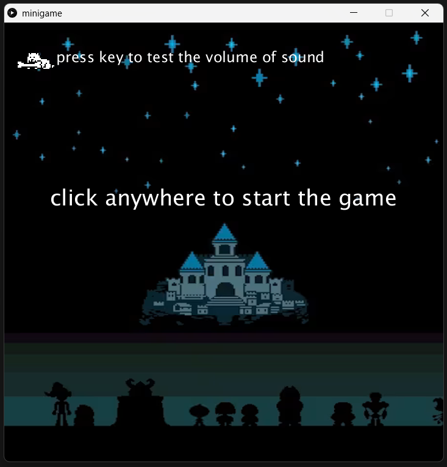
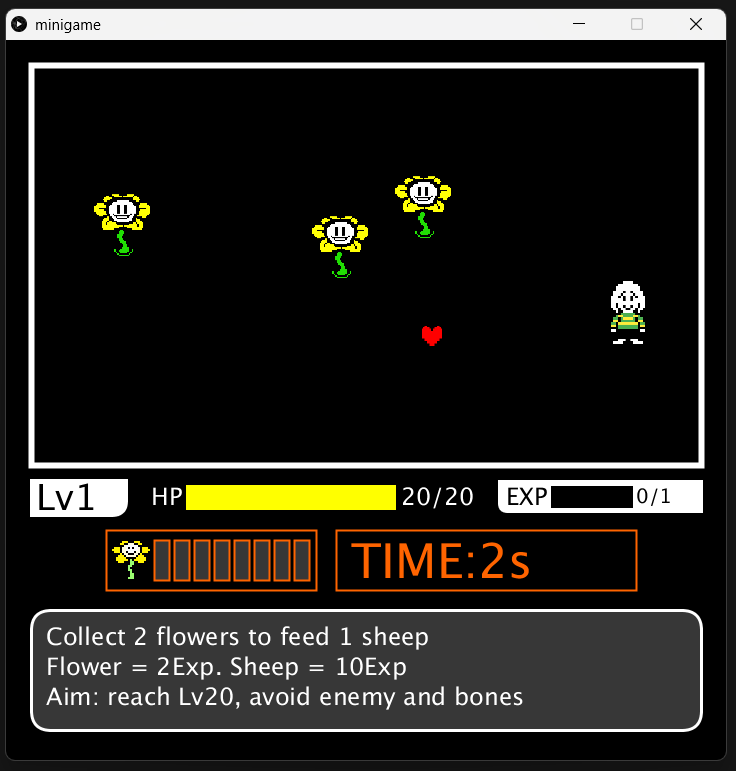
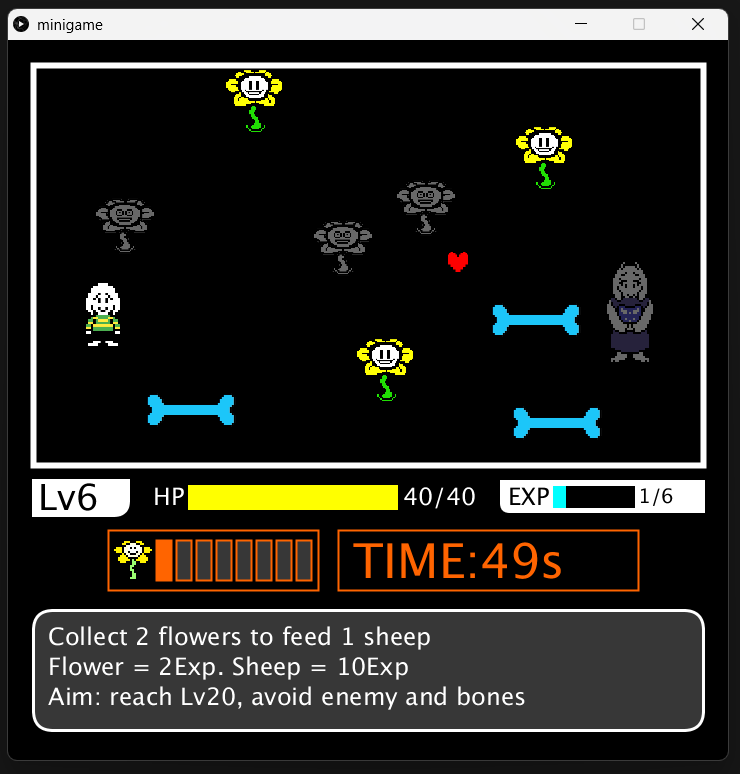
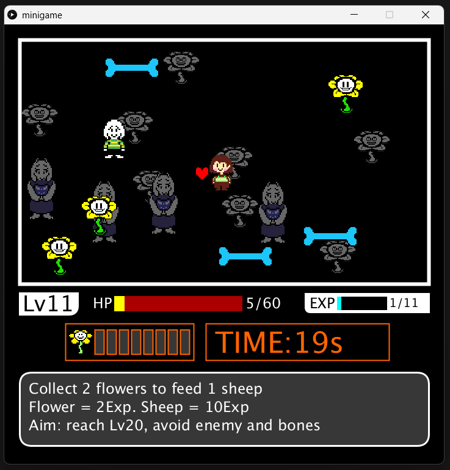
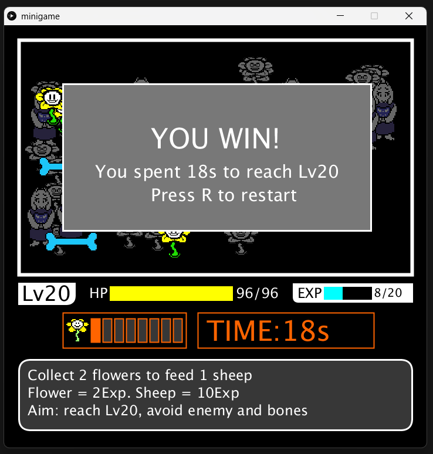
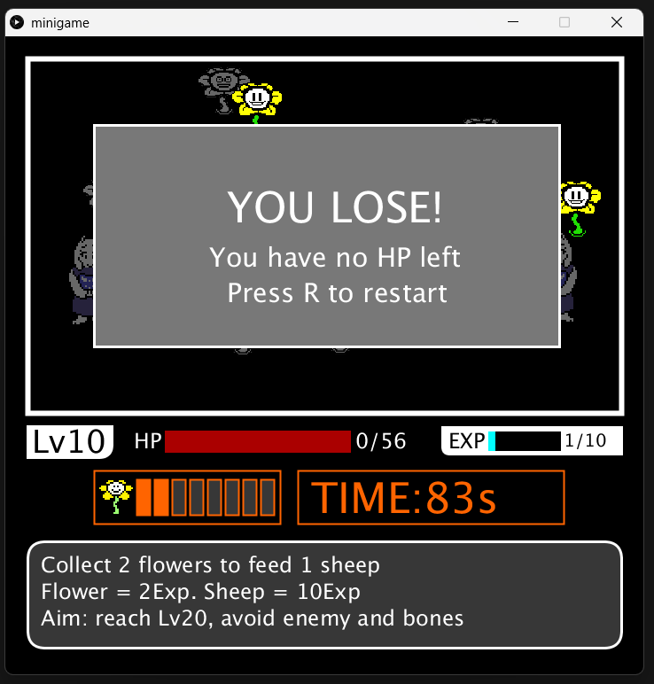

# COMP1005 Mini Game Project

A simple yet challenging shooting survival game inspired by **Undertale**'s famous encounter, created as the mini project for **COMP1005 Essence of Computing**.

## Game Concept

There are flowers growing on your screen.
**Shoot them** to gain EXP → Level up → Survive longer  
Reach **Lv.20** before your HP reaches zero.

## Screenshots
**Welcome Screen:** The starting screen with instructions and sound test.
- 

**Early game:** Shooting Flowey, collecting flowers, HP/EXP bars.
- 

**Mid-game:** Bones appearing, feeding sheep, enemy pursuit.
-  

**Win/Lose Screen:** Victory screen showing time spent to reach Lv20. Lose screen appears when HP depletes.
-  

## Logic
**Heart:** 
- The red heart represents your cursor. Move the heart to collect flowers and feed sheeps.
  - **Mouse** → Move heart
  - **Left Click** → Shoot flowers / Feed sheep (need ≥2 flowers)
 
**Flower:**  (1 Flower = 2 EXP)
- Click the flowers to collect them.

**Sheep:**  (1 Sheep = 10 EXP)
- After collecting enough flowers, you can consume 2 flowers to feed a sheep.

**Bone:**  (1 Bone → HP-7)
- Bones appear and fly across screen after you reach lv5. It hurts you if your cursor torch them. Try to move your cursor away from the bones.

**Enemy:**  (0.1 second → HP-1)
- Moving enemy appears and chase your cursor after you reach lv10. It hurts you if your cursor torch them. Try to move your cursor away from the enemy.

## Features

- Three main stages: Welcome → Gameplay → Win/Lose
- Leveling system (Lv.1 → Lv.20)
- EXP from shooting flowers (2 EXP) & feeding sheep (10 EXP)
- Increasing difficulty:
  - Bones flying across screen (Lv.5+)
  - Moving enemy character (Lv.10+)
- Sound effects (hurt, heal, victory, etc.) using Minim library
- Pixel-art style with Undertale-inspired assets

## Controls

- **Mouse** → Move heart
- **Left Click** → Shoot flowers / Feed sheep (need ≥2 flowers)
- **Any key** → Start game from welcome screen
- **R** → Restart after win/lose

## Requirements

Processing 3.5.4 or newer version
- Import Modes: Python Mode for Processing 3 (for Python mode)
- Import Libraries: Minim (for sound)

## Credits / References

- Game assets: Undertale (by Toby Fox)

## License
This project is for educational purposes only. Assets are used under fair use for non-commercial academic work.
